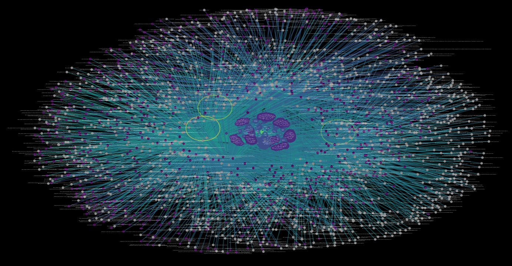

Note: This program cannot guarantee a lack of bias but rather works to eliminate bias through a variety of sources (if there is bias in all the sources there is more than likely going to be bias in highest ranking articles).

Least biased nodes are closest to the center of all nodes while highest ranking nodes (highest frequency and least biased) are closest to the center of central cluster of nodes (center of mass) 
